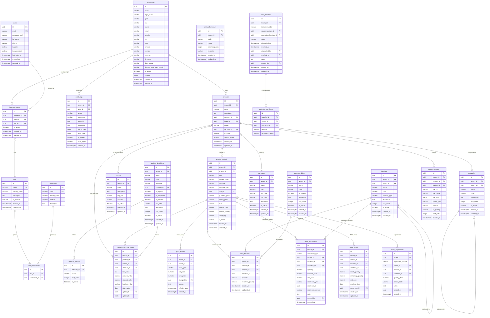

# StockPilot — Entity Relationship Diagram (ERD)

## Phase 0 & Phase 1 Complete Schema

```mermaid
erDiagram
    businesses {
        uuid id PK
        varchar name
        varchar legal_name
        varchar gstin
        varchar pan
        varchar phone
        varchar email
        varchar website
        varchar city
        varchar state
        varchar pincode
        varchar country
        varchar currency
        varchar timezone
        varchar date_format
        varchar financial_year_start_month
        boolean is_active
        jsonb settings
        timestamptz created_at
        timestamptz updated_at
    }

    users {
        uuid id PK
        varchar email UK
        varchar password_hash
        varchar full_name
        varchar phone
        boolean is_active
        boolean is_superadmin
        timestamptz last_login_at
        timestamptz created_at
        timestamptz updated_at
    }

    roles {
        uuid id PK
        varchar name UK
        varchar display_name
        text description
        boolean is_system
        timestamptz created_at
        timestamptz updated_at
    }

    permissions {
        uuid id PK
        varchar code UK
        varchar display_name
        varchar module
        text description
    }

    role_permissions {
        uuid id PK
        uuid role_id FK
        uuid permission_id FK
    }

    business_users {
        uuid id PK
        uuid business_id FK
        uuid user_id FK
        uuid role_id FK
        boolean is_active
        timestamptz created_at
        timestamptz updated_at
    }

    audit_logs {
        uuid id PK
        uuid tenant_id FK
        uuid user_id FK
        varchar action
        varchar entity_type
        uuid entity_id
        text description
        jsonb before_data
        jsonb after_data
        varchar ip_address
        varchar user_agent
        timestamptz created_at
    }

    categories {
        uuid id PK
        uuid tenant_id FK
        uuid parent_id FK
        varchar name
        varchar code
        text description
        integer sort_order
        boolean is_active
        timestamptz created_at
        timestamptz updated_at
    }

    brands {
        uuid id PK
        uuid tenant_id FK
        varchar name
        text description
        varchar logo_url
        varchar website
        boolean is_active
        timestamptz created_at
        timestamptz updated_at
    }

    units_of_measure {
        uuid id PK
        uuid tenant_id FK
        varchar code
        varchar name
        integer decimal_places
        boolean is_active
        timestamptz created_at
        timestamptz updated_at
    }

    locations {
        uuid id PK
        uuid tenant_id FK
        uuid parent_id FK
        varchar name
        varchar code
        varchar location_type
        text description
        integer sort_order
        boolean is_active
        timestamptz created_at
        timestamptz updated_at
    }

    stock_conditions {
        uuid id PK
        uuid tenant_id FK
        varchar name
        varchar code
        boolean is_sellable
        text description
        integer sort_order
        boolean is_active
        timestamptz created_at
        timestamptz updated_at
    }

    tax_rates {
        uuid id PK
        uuid tenant_id FK
        varchar name
        numeric rate
        varchar hsn_code
        varchar sac_code
        text description
        boolean is_active
        timestamptz created_at
        timestamptz updated_at
    }

    attribute_definitions {
        uuid id PK
        uuid tenant_id FK
        varchar name
        varchar code
        varchar data_type
        uuid category_id FK
        boolean is_required
        boolean is_searchable
        boolean is_filterable
        varchar unit_label
        text description
        integer sort_order
        boolean is_active
        timestamptz created_at
        timestamptz updated_at
    }

    attribute_options {
        uuid id PK
        uuid attribute_id FK
        varchar value
        integer sort_order
        boolean is_active
    }

    products {
        uuid id PK
        uuid tenant_id FK
        varchar name
        text description
        uuid category_id FK
        uuid brand_id FK
        varchar model
        uuid tax_rate_id FK
        boolean is_active
        tsvector search_vector
        timestamptz created_at
        timestamptz updated_at
    }

    product_variants {
        uuid id PK
        uuid tenant_id FK
        uuid product_id FK
        varchar sku
        varchar variant_name
        varchar barcode
        varchar barcode_type
        uuid unit_id FK
        numeric purchase_price
        numeric selling_price
        numeric mrp
        numeric reorder_point
        numeric reorder_quantity
        numeric weight_kg
        boolean is_active
        timestamptz created_at
        timestamptz updated_at
    }

    product_attribute_values {
        uuid id PK
        uuid tenant_id FK
        uuid product_id FK
        uuid variant_id FK
        uuid attribute_id FK
        text text_value
        numeric numeric_value
        numeric decimal_value
        boolean boolean_value
        date date_value
        uuid option_id FK
        jsonb option_ids
    }

    product_images {
        uuid id PK
        uuid tenant_id FK
        uuid product_id FK
        uuid variant_id FK
        varchar file_url
        varchar file_name
        integer file_size
        varchar mime_type
        varchar caption
        boolean is_primary
        integer sort_order
        timestamptz created_at
    }

    price_history {
        uuid id PK
        uuid tenant_id FK
        uuid variant_id FK
        varchar price_type
        numeric old_price
        numeric new_price
        uuid changed_by FK
        text reason
        timestamptz effective_date
        timestamptz created_at
    }

    stock_balances {
        uuid id PK
        uuid tenant_id FK
        uuid variant_id FK
        uuid location_id FK
        uuid condition_id FK
        numeric quantity
        numeric reserved_quantity
        timestamptz created_at
        timestamptz updated_at
    }

    stock_movements {
        uuid id PK
        uuid tenant_id FK
        varchar movement_type
        uuid variant_id FK
        uuid location_id FK
        uuid condition_id FK
        numeric quantity
        numeric balance_after
        numeric unit_cost
        varchar reference_type
        uuid reference_id
        varchar reference_number
        text notes
        uuid created_by FK
        timestamptz created_at
    }

    stock_layers {
        uuid id PK
        uuid tenant_id FK
        uuid variant_id FK
        uuid location_id FK
        uuid condition_id FK
        numeric initial_quantity
        numeric remaining_quantity
        numeric unit_cost
        date received_date
        uuid movement_id FK
        timestamptz created_at
        timestamptz updated_at
    }

    stock_transfers {
        uuid id PK
        uuid tenant_id FK
        varchar transfer_number
        uuid source_location_id FK
        uuid destination_location_id FK
        varchar status
        timestamptz dispatched_at
        timestamptz received_at
        uuid dispatched_by FK
        uuid received_by FK
        text notes
        uuid created_by FK
        timestamptz created_at
        timestamptz updated_at
    }

    stock_transfer_items {
        uuid id PK
        uuid transfer_id FK
        uuid variant_id FK
        uuid condition_id FK
        numeric quantity
        numeric received_quantity
    }

    stock_adjustments {
        uuid id PK
        uuid tenant_id FK
        varchar adjustment_number
        uuid variant_id FK
        uuid location_id FK
        uuid condition_id FK
        numeric quantity_delta
        varchar reason_code
        text notes
        uuid created_by FK
        timestamptz created_at
    }

    businesses ||--o{ business_users : "memberships"
    users ||--o{ business_users : "belongs to"
    business_users }o--|| roles : "role"
    roles ||--o{ role_permissions : "grants"
    permissions ||--o{ role_permissions : "granted by"
    businesses ||--o{ audit_logs : "logged for"
    businesses ||--o{ products : "owns"
    categories ||--o{ categories : "subcategories"
    locations ||--o{ locations : "sublocations"
    products ||--o{ product_variants : "has SKUs"
    products }o--o| categories : "categorized in"
    products }o--o| brands : "manufactured by"
    products }o--o| tax_rates : "taxed by"
    products ||--o{ product_attribute_values : "has attributes"
    product_variants ||--o{ product_attribute_values : "variant attributes"
    attribute_definitions ||--o{ attribute_options : "options"
    attribute_definitions ||--o{ product_attribute_values : "values"
    products ||--o{ product_images : "images"
    product_variants ||--o{ price_history : "tracks prices"
    product_variants ||--o{ stock_balances : "balance records"
    locations ||--o{ stock_balances : "stored at"
    stock_conditions ||--o{ stock_balances : "in condition"
    product_variants ||--o{ stock_movements : "movement ledger"
    locations ||--o{ stock_movements : "movement location"
    product_variants ||--o{ stock_layers : "FIFO layers"
    stock_transfers ||--o{ stock_transfer_items : "transfers items"
    product_variants ||--o{ stock_adjustments : "adjustments"
```
